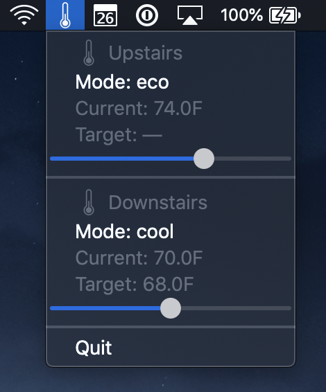
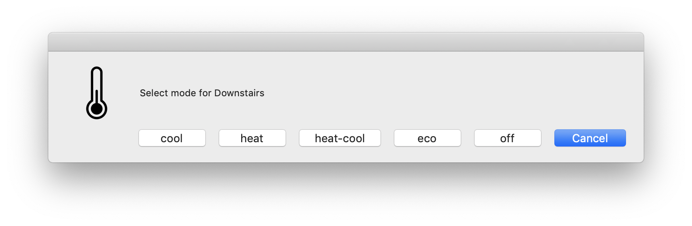

# Nest Thermostat Menubar App

This is a basic menubar app that allows you to control your Nest thermostats.

To use this app, you first need to set up Google Nest Device Access using the Smart Device Management API (this involves paying a one-time $5 fee). Follow the [instructions in the python-google-nest README](https://github.com/axlan/python-nest/blob/master/README.md).

After launch, you can change the mode and temperature setting of each Nest thermostat:

If you select the mode from the menu, you will be prompted to select the mode for the corresponding thermostat:

## Requirements

* Python == 3.9
* [python-google-nest](https://github.com/axlan/python-nest) >= 5.1.1
* [rumps](https://github.com/jaredks/rumps) >= 0.3.0
* [py2app](https://py2app.readthedocs.io) >= 0.19

## Installation

    python3 -m venv venv
    source venv/bin/activate
    pip install wheel
    pip install --isolated -r requirements.txt
    python3 setup.py py2app
    cp -r dist/NestMenubar.app /Applications/

## Acknowledgements

The thermostat icon is from [the Noun Project](https://thenounproject.com/term/thermostat/379763/).
